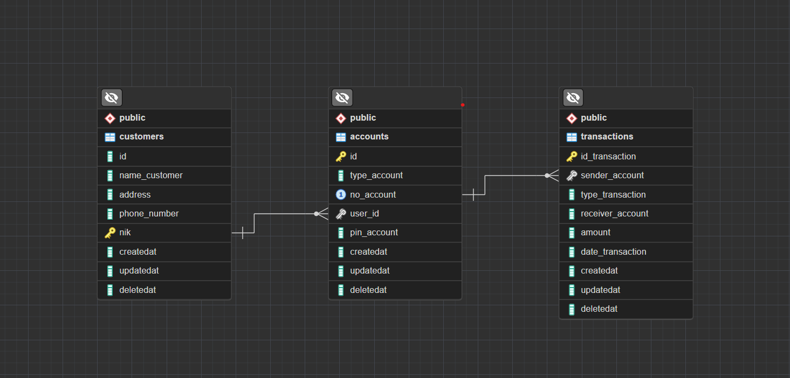

# Skill Metrics

- [x] Database
- [x] DBMS (Database Management System)
- [x] Query Language
- [x] Database Indexing and Query Optimization
- [x] RDBMS

# Delivery

1. Data structure analysis in Challenge 2
2. Design a simple Entity Relationship Diagram (ERD) that includes the necessary tables 
3. Create a SQL file named <kbd> create_and_insert.sql </kbd> 
4. Write SQL commands to create tables according to the ERD you designed 
5. Fill the SQL file with SQL commands to fill in some initial data into the tables 

# Criteria

1. Able to design and create ERD <kbd> 40 points </kbd>
2. Create Databases & Tables using DDL <kbd> 30 points </kbd>
3. Perform CRUD operations with DML <kbd> 30 points </kbd>

# Study Case

A bank wants to set up a system to track customer information, their accounts, and transactions. They want you to design a database that fits their needs.

# Entity

- Customer
- Accounts
- Transactions

# Relationship

- [x] One Customer can have multiple Accounts, but each Account is owned by only one Customer 
- [x] One Account can have multiple Transactions, but each Transaction relates to only one Account

# Entity Relationship Diagram (ERD)

